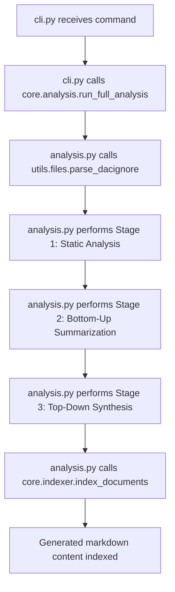
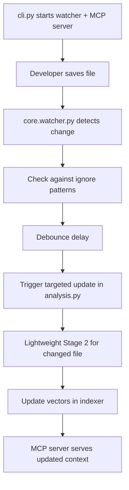
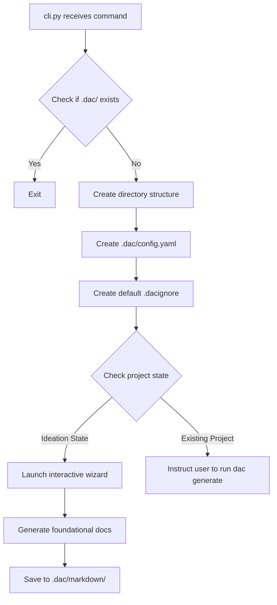

# SourceDAC: Technical Design & Implementation Pathway

> This document serves as the technical blueprint for the AI agents (@architect, @python_expert) building SourceDAC. It details the project structure, component responsibilities, and key data flows.

## 📁 1. Codebase Structure

The SourceDAC tool itself will be structured as a standard installable Python package.

```
sourcedac/
├── src/
│   └── sourcedac/
│       ├── __init__.py
│       ├── cli.py             # Typer command definitions and CLI entry point
│       ├── core/
│       │   ├── __init__.py
│       │   ├── analysis.py    # Multi-stage analysis logic for `generate`
│       │   ├── config.py      # Handles loading config from files and env vars
│       │   ├── indexer.py     # Manages ChromaDB indexing and querying
│       │   └── watcher.py     # Implements the `watchdog` file monitor
│       ├── mcp/
│       │   ├── __init__.py
│       │   └── server.py      # FastAPI server and endpoint definitions
│       └── utils/
│           ├── __init__.py
│           └── files.py       # Filesystem utilities, .dacignore parser
├── tests/
│   └── ...                    # Unit and integration tests
├── pyproject.toml             # Packaging, dependencies, and project metadata
└── README.md
```

## 🧩 2. Core Component Breakdown

### `cli.py`
- **Framework:** Typer
- **Responsibility:** Defines all `dac` commands (`init`, `generate`, `dev`, `query`, `optimize`). This module is the main user-facing entry point.
- **Logic:** It should delegate all complex business logic to the core modules. For the `dev` command, it will use Python's multiprocessing or threading to run the watcher and mcp server concurrently.

### `core/analysis.py`
- **Responsibility:** Contains the logic for the `dac generate` command.

#### Stage 1: Static Analysis
Implements a function that uses tree-sitter to parse all non-ignored files and builds a structural map (`repo_structure.json`).

#### Stage 2: Bottom-Up Summarization
Implements a function that iterates through files, calls the LLM via the abstraction layer, and saves the `.md` outputs.

#### Stage 3: Top-Down Synthesis
Implements the function that constructs the "God Prompt" (with project goal, structural map, and all file summaries) to generate the final `ARCHITECTURE.md`.

### `core/indexer.py`
- **Framework:** chromadb-client
- **Responsibility:** Manages all interactions with the local vector store.

#### Functions:
- `initialize_collection()`: Creates or loads the ChromaDB collection from the `.dac/index` directory.
- `index_documents(docs: List[Document])`: Takes generated markdown content, chunks it appropriately, and upserts it into ChromaDB.
- `query_index(query_text: str, k: int) -> List[str]`: Takes a natural language query, embeds it, and returns the k most relevant text chunks.

### `core/config.py`
- **Responsibility:** Provides a unified way to access configuration settings.
- **Logic:** Implements the layered configuration lookup:
  1. Check for environment variables (e.g., `OPENAI_API_KEY`, `DAC_MODEL`)
  2. If not found, check the project's `.dac/config.yaml`
  3. If not found, check the global `~/.config/sourcedac/config.yaml`
- **LLM Abstraction:** This module will configure litellm based on the loaded settings.

### `mcp/server.py`
- **Framework:** FastAPI
- **Responsibility:** Defines and implements the `/query` and `/optimize` endpoints.
- **Logic:** The endpoint handlers will be thin wrappers that call the functions in `core/indexer.py` and the prompt templating logic.

### `utils/files.py`
- **Responsibility:** Contains helper functions for filesystem operations.
- **Key Function:** `parse_dacignore(path)`: Reads the `.dacignore` file and returns a list of glob patterns. The watcher and analysis modules will use this to filter file lists.

## 🔄 3. Key Data Flows

### Flow 1: `dac generate`



**Step-by-step:**
1. `cli.py` receives the command
2. `cli.py` calls `core.analysis.run_full_analysis()`
3. `analysis.py` calls `utils.files.parse_dacignore()` to get ignore patterns
4. `analysis.py` performs Stage 1 (Static Analysis) on all non-ignored files
5. `analysis.py` performs Stage 2 (Bottom-Up), saving `.md` files to `.dac/markdown/`
6. `analysis.py` performs Stage 3 (Top-Down), saving `ARCHITECTURE.md`
7. `analysis.py` calls `core.indexer.index_documents()` with all generated markdown content

### Flow 2: `dac dev` (Live Update)



**Step-by-step:**
1. `cli.py` starts two concurrent processes: the watcher and the mcp server
2. A developer saves a file (e.g., `src/api/user.py`)
3. `core.watcher.py` detects the change and checks it against the ignore patterns
4. After a debounce delay, the watcher triggers a targeted update function in `core.analysis.py`
5. `analysis.py` runs a lightweight version of Stage 2 for only `src/api/user.py`
6. `analysis.py` calls `core.indexer.index_documents()` to update the vectors for that specific file
7. The MCP server continues running, now able to serve queries that include the freshly updated context

### Flow 3: `dac init`



**Step-by-step:**
1. `cli.py` receives the command
2. `cli.py` checks if the `.dac/` directory already exists. If so, it exits
3. `cli.py` creates the core directory structure: `.dac/`, `.dac/markdown/`, and `.dac/index/`
4. `cli.py` creates the project's `.dac/config.yaml` file
5. `cli.py` creates a default `.dacignore` file in the project root if one doesn't exist
6. The tool checks if the project is in the "Ideation State" (e.g., no `src/` directory)
7. **If in Ideation State:** `cli.py` launches an interactive wizard. The user's answers are used to call the LLM and generate foundational design documents (e.g., `MISSION.md`, `ARCHITECTURE_PROPOSAL.md`) which are saved to `.dac/markdown/`
8. **If in Existing Project:** The command finishes, instructing the user to run `dac generate` next

---

*This technical design provides the foundation for building a robust, scalable, and maintainable SourceDAC implementation.*